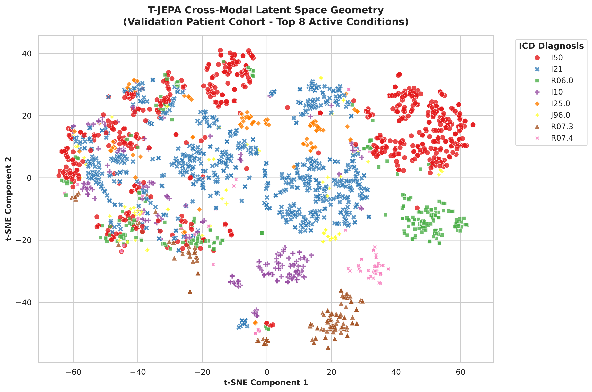

# Multi-Modal-Cardiovascular-Diseases-Classifier
Tabular-text multi-modal based on T-JEPA architecture

The core architecture utilizes a **Time-Series Joint Embedding Predictive Architecture (T-JEPA)** style matching pipeline. It projects low-dimensional tabular measurements into the semantic neighborhood of a frozen, state-of-the-art Vietnamese language model backbone (vinai/phobert-base-v2), achieving high-precision classification constraints with low trainable parameter footprints.

### 🛠️ Development & Tooling Disclosure
Architected and directed by the author, with optimization, boilerplate compilation, and documentation formatting co-piloted by Google Gemini. All structural research boundaries (patient-level validation isolation, physiological-bounded scaling, and multi-modal ablation mechanics) were strictly designed and verified by the author.

---

## 🔬 Core Architecture & Technical Highlights

* **Leakage-Free Patient-Level Separation:** Rejects standard row-wise random slicing. The evaluation rails enforce a strict patient-level boundary wall at the database root layer, ensuring that validation datasets are comprised entirely of unseen individuals to verify true real-world generalization bounds.
* **Bounded Clinical Min-Max Normalization:** Implements a physiological-bounded scalar transformation pipeline. Active continuous vitals are mapped into a $[0.0, 1.0]$ coordinate space relative to known human survival extremes, preserving the structural integrity of binary missingness indicator masks at absolute zero without injecting covariate bias.
* **Multi-Modal Concat Fusion Head:** Employs a 2-layer downstream Multi-Layer Perceptron (MLP) with `nn.GELU` non-linear activations, static layer regularizers (`nn.LayerNorm`), and dropout channels to safeguard decision hyperplanes from majority-class memorization loops.
* **Shannon Entropy Triage Gate:** Integrates an information-theoretic confidence filter. Patient profiles yielding a prediction distribution entropy greater than 1.5 bits are automatically routed to human auditing streams, securing near-perfection on the automated sub-cohort.

---

## 📊 Empirical Validation & Ablation Study

The framework was systematically verified using an uncompromised validation cohort across **97 unique active ICD-10 diagnostic classes**. 

The evaluation matrix contrasts the production multimodal network against two strict baseline isolation modes: a standalone vitals-only encoder head and an extreme zero-imputation blind text check.

### Evaluation Summary Matrix

| Evaluation Strategy | Top-1 Accuracy (Exact Code) | Top-5 Accuracy (Differential) | Mean Cohort Entropy | Automated Flagged Triage Rate |
| :--- | :---: | :---: | :---: | :---: |
| **1. Complete Multimodal** <br>*(Vitals + Active PhoBERT)* | **96.64%** | **98.55%** | **0.2423 bits** | **5.25%** |
| **2. Standalone Vitals Head** <br>*(Dedicated Tabular MLP)* | **26.69%** | **67.05%** | **4.2680 bits** | **100.00%** |
| **3. Blind Multi-Modal Head** <br>*(Production Head + Zeroed Text)* | **2.55%** | **14.27%** | **6.8897 bits** | **100.00%** |

### Latent Space Manifold Geometry
Non-linear manifold decomposition using t-SNE demonstrates distinct, dense, multi-centroid phenotyping islands for high-volume conditions (e.g., `I50` Heart Failure and `I21` Acute Myocardial Infarction). Furthermore, the topology preserves continuous physiological symptom continuums, mapping non-specific indicators like chest pain (`R07.3`, `R07.4`) immediately adjacent to their corresponding definitive cardiovascular endpoints.



---

## 🛠️ Data Pipeline & Feature Engineering

The input vector pipelines are constructed using two strictly isolated clinical database streams:

### 1. Tabular Vital Signs Pathway
Extracts 6 raw clinical metrics mapped to a unified 12-dimensional vector space:
* **Systolic & Diastolic Blood Pressure:** Split text-parsed dynamically from a single continuous string.
* **Pulse / Heart Rate, Body Temperature, Weight, and Height:** Processed using continuous scalar metrics.
* **Missingness Indicator Masks:** Every individual vital sign is assigned a paired binary indicator (`1.0` if present, `0.0` if missing). If missing, the value remains `0.0`, ensuring data gaps do not corrupt feature bounds.

### 2. Natural Language Text Pathway
Constructs a unified text prompt using a specialized clinical template:
```text
"Chẩn đoán: [Initial Diagnosis String]. Kết luận: [Clinical Conclusion String]"
```

---

## 🎛️ Network Input, Target Label, and Layer Architecture Specifications

To ensure complete structural transparency for code audits and academic peer reviews, the exact specifications of the data shapes, label mapping, and native PyTorch layer topologies are detailed below.

---

### 1. Model Input Channels & Target Specifications

The model processes two distinct input modalities which are projected and fused before entering the classification pipeline. The ground-truth diagnostic targets are kept strictly isolated from the feature space.

| Tensor Stream | Source Column(s) | Native Format | Extracted Dimensions / Shape | Clinical/Mathematical Role |
| :--- | :--- | :--- | :--- | :--- |
| **Tabular Vitals Vector** | `huyetap`, `mach`, `nhietdo`, `cannang`, `chieucao` | Continuous Numeric + Missingness Flags | **12-Dimensional Vector** <br>`[Batch, 12]` | **Coarse Localization Input:** Contains 6 continuous vital features normalized via clinical min-max bounding, paired with 6 binary missingness masks. |
| **Textual Latent Embedding** | `chandoan`, `ketluan` | PhoBERT v2 Tokenized Context String | **768-Dimensional Vector** <br>`[Batch, 768]` | **Fine-Grained Context Input:** Deep semantic feature space capturing clinical nuances and text summaries. |
| **Target Label ID** | `maicd` | Categorical String Mapped to Unique Integer ID | **Scalar Class Index** <br>`[Batch, 97]` | **Ground-Truth Supervision:** Represents the active target condition out of 97 unique ICD-10 classes. Used strictly for loss calculation. |

---

### 2. Actual Neural Network Layer Architecture

The deep learning pipeline maps the inputs through a dedicated tabular context encoder before feeding the concatenated joint multi-modal tensor into a regularized downstream classification head.

```text
Input Tabular Vitals (12-d) ──> [ Vitals Context Encoder ] ──> Latent Vitals (128-d) ──┐
                                                                                       ├──> Concatenated Representation (896-d) ──> [ Multimodal Downstream Classifier Head ] ──> Logits (97-d)
Input Text Latent (768-d) ─────────────────────────────────────────────────────────────┘
```

### 3. Hyperparameters

```
batch_size: int = 256            # Maximizes parallel gradient stability
pretrain_lr: float = 5e-5        # Learning rate for latent alignment
downstream_lr: float = 5e-4      # Regulated rate for classification head
pretrain_epochs: int = 35        # Extended training for coordinate maturity
downstream_epochs: int = 30      # Optimizes downstream classification paths
weight_decay: float = 1e-4       # L2 Regularization barrier against overfitting
grad_clip_norm: float = 0.5      # Strict clipping constraint to prevent gradient explosion
```
