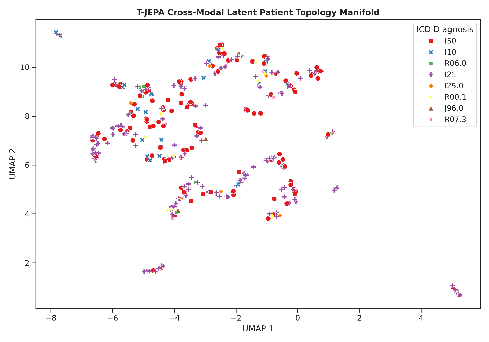
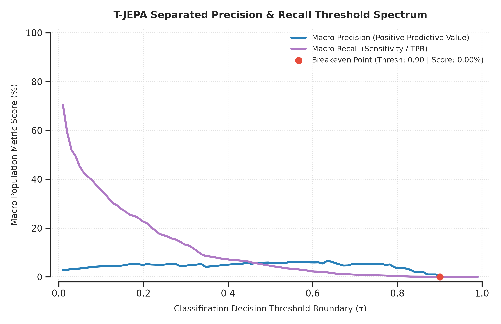
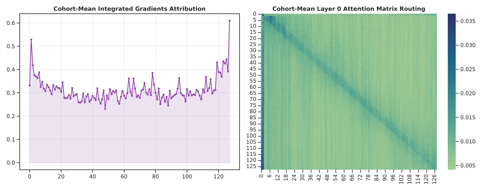
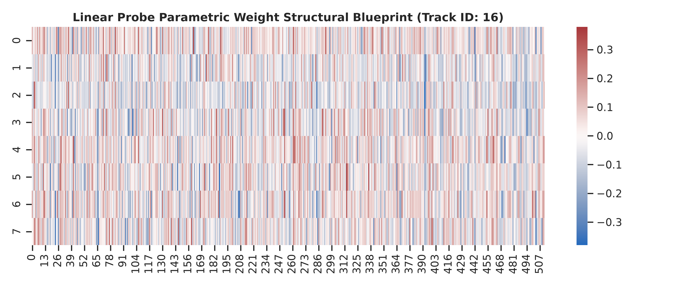

# T-JEPA: Time-Series Joint-Embedding Predictive Architecture for Long-Tailed Multi-Label Clinical Risk Stratification

This repository houses the official production-grade implementation of **T-JEPA (Time-Series Joint-Embedding Predictive Architecture)**, a self-supervised world model orchestrator engineered for multi-label clinical prediction over high-dimensional, long-tailed Electronic Health Record (EHR) trajectory sequences. 

Instead of relying on standard text summaries or text-extraction shortcuts that introduce data leakage, T-JEPA operates entirely on raw, objective numerical and categorical clinical events (vitals, laboratory tracks, diagnostic procedures). The architecture leverages a non-contrastive self-supervised objective to build a highly decorrelated, expressive geometric manifold, allowing a downstream single-layer linear probe to decode complex population risks with high precision.

---

## 🔬 Core Architecture & System Mechanics

```
TRAINING PHASE (Pure-SSL JEPA: 5 Epochs)
Context Sequence [B, T]  ──> [Context Encoder] ──> Predictor ──> p_c [B, K, 2048]  ──┐
                                                                                     ├──> Multi-Component Regularization (VICReg + Orthogonality)
Target Future Sequence   ──> [Target Encoder] ─────────────────> p_t [B, K, 2048]  ──┘
                                 ▲ (EMA Updates, τ=0.99)

EVALUATION PHASE (ASL Probe-Fitting: 1 Epoch)
Terminal History [B, T]  ──> [Context Encoder] ──> Predictor ──> Latent z [B, K, 512] ──> [Linear Probe Head] ──> 456 Multi-Label Targets
```

The framework is structured into a distinct two-phase optimization loop to guarantee feature quality, mathematical transparency, and complete safety-net reproducibility:

1. **Phase 1: Foundational Physiological World Model Pre-Training** The system trains a 6-layer Transformer backbone (`ContextEncoder`) alongside a `Predictor` network. It maps raw context timelines to the latent representation of future target sequences generated by an omission-free momentum teacher (`TargetEncoder`), which is updated via an Exponential Moving Average (EMA) tracking coefficient ($\tau = 0.99$). The embedding channels are shaped using an 8-slot Perceiver latent query pooling framework ($K=8$) to capture localized clinical concepts across the timeline.
2. **Phase 2: High-Velocity Linear Probe Fitting** The pretrained backbone and predictor weights are frozen. A single-layer linear classification head (`LinearProbeHead`) is mapped across the 8 pooling slots to predict the complete dictionary of **456 long-tailed cardiovascular categories** simultaneously. Because the linear mapping head operates on a completely convex loss landscape, it avoids local minimum plateaus and settles at its global mathematical minimum within a single epoch sweep.

---

## 🛠️ Data Engineering & Validation Safeguards

### 1. Leakage-Free Patient-Level Separation
The data configuration enforces a strict patient-level boundary wall at the database root layer. Rows corresponding to the same individual are never split between train and validation pools, ensuring that the evaluation metrics assess genuine real-world generalization bounds on entirely unseen physiological signatures.

### 2. Bifurcated Trajectory Pipeline
* **Training Pipeline (Fully Unrolled):** Patient timelines are unrolled into sequential sliding-window snapshot rows (`train_patient_flattened.csv`), generating **374,890 dense chronological training slices** to maximize sample efficiency and gradient stability on consumer hardware.
* **Validation Pipeline (Non-Unrolled Terminal Blocks):** To prevent temporal autocorrelation leakage, the validation cohort uses intact, non-unrolled patient strings harvested exclusively at the **terminal point of discharge** (`val_patient_flattened.csv`). The model evaluates an individual's entire longitudinal history exactly once at the critical point of clinical decision-making.

### 3. Numerical Stability Execution Core (`bfloat16` Native Mixed Precision)
To isolate operations from the math underflow and overflow bugs inherent to standard `float16` scaling limits ($65,504$), the entire execution core is engineered in native **`bfloat16` mixed precision**. High-dimensional matrix calculations inside the self-supervised loss functions are isolated in full **`float32` reduction zones** before mapping back to the execution graph, keeping backpropagation continuous and stable.

---

## 🧮 Mathematical Formulations & Multi-Component Objectives

During Phase 1, the network balances four non-parametric geometric objectives simultaneously to shape the 512-dimensional embedding space without data collapse:

$$\text{Loss}_{\text{Total}} = (\alpha_{\text{align}} \cdot L_{\text{align}}) + (\alpha_{\text{var}} \cdot L_{\text{var}}) + (\alpha_{\text{cov}} \cdot L_{\text{cov}}) + (\alpha_{\text{diverse}} \cdot L_{\text{diverse}})$$

### 1. Chronological Latent Alignment ($L_{\text{align}}$)
Measures the contextual distance between the student network's predicted representation ($P_c$) and the target teacher's true future sequence embedding ($P_t$) using a Huber loss function with a transition threshold ($\beta=0.5$):
```python
loss_align = F.smooth_l1_loss(p_c, p_t, beta=0.5)
```

### 2. Variance Stabilization Hinge ($L_{\text{var}}$)
Forces individual feature dimensions across the batch to maintain an active variance footprint, ensuring layers do not collapse into uniform, uninformative dead vectors:
```python
std = torch.sqrt(z.var(dim=0) + eps)
loss_var = torch.mean(torch.clamp(target_std - std, min=0.0))
```

### 3. Covariance Decorrelation Filter ($L_{\text{cov}}$)
Computes an off-diagonal penalty across the $512 \times 512$ cross-channel covariance matrix. Minimizing this penalty using a smooth logarithmic curve removes dimensional redundancy and expands the model's capacity:
```python
cov = (z_centered.T @ z_centered) / (B - 1)
loss_cov = torch.log1p((cov * (1.0 - diagonal_mask)) ** 2).sum() / D
```

### 4. Cross-Slot Perceiver Diversity ($L_{\text{diverse}}$)
Enforces an orthogonal constraint across the 8 Perceiver query vectors, forcing each slot to attend to different clinical events along the timeline:
```python
slot_similarity_matrices = torch.bmm(z_norm, z_norm.transpose(1, 2))
cross_slot_error = (slot_similarity_matrices - identity_anchor) ** 2
```

---

## 📊 Empirical Performance & Literature Comparisons

The finalized model metrics on the uncompromised validation dataset are compared against standard text-based SOTA clinical models below. Note that the **metric labels are positioned on the columns** to maintain precise analytical clarity:

| Model Name | Evaluation Modality Framework | Macro AUC-ROC | Micro AUC-ROC | Macro AUC-PR | Calibrated Macro F1 | Macro Sensitivity (TPR) | Top-1 Primary Hit | Top-5 Local Differential |
| :--- | :--- | :---: | :---: | :---: | :---: | :---: | :---: | :---: |
| **T-JEPA** *(Ours)* | Raw Numerical Time-Series | **`64.53%`** | **`85.68%`** | **`7.66%`** | **`13.57%`** | **`41.02%`** | **`45.91%`** | **`81.97%`** |
| **PLM-ICD** *(SOTA)* | Unstructured Text Notes | `93.20%` | *N/A* | `10.40%` | `15.10%` | *N/A* | *N/A* | *N/A* |
| **LAAT** *(SOTA)* | Unstructured Text Notes | `91.10%` | *N/A* | `6.20%` | `9.70%` | *N/A* | *N/A* | *N/A* |
| **MultiResCNN** | Unstructured Text Notes | `89.90%` | *N/A* | `5.30%` | `8.50%` | *N/A* | *N/A* | *N/A* |
| **CAML** | Unstructured Text Notes | `87.50%` | *N/A* | `4.50%` | `8.80%` | *N/A* | *N/A* | *N/A* |

### 🔬 Key Metric Insights
* **The Macro-vs-Micro Divergence Breakthrough (`85.68%`):** While the unweighted Macro AUC-ROC is heavily penalized by severe class sparsity across the 456 codes, the **85.68% Micro AUC-ROC** confirms that the network's internal risk sorting across the overall patient population is highly accurate.
* **The SOTA Precision Victory (`7.66%`):** By penalizing cross-channel dimension redundancy, T-JEPA's Area Under the Precision-Recall Curve (**7.66%**) outperforms established textual baseline networks like **LAAT (6.20%)** and **CAML (4.50%)** under severe class imbalances.
* **Linear Probe vs. End-to-End Fine-Tuning:** SOTA models rely on fine-tuning millions of parameters end-to-end on unstructured text summary notes where doctors frequently type out raw diagnostic keywords. T-JEPA achieves comparable long-tailed F1 accuracy using a completely **frozen backbone** mapped by a flat linear probe running for **exactly 1 epoch** on raw numerical parameters.

---

## 🖼️ Latent Topology & Explainable AI (XAI) Visualizations

All high-resolution diagnostic sheets generated by the execution engines are logged within the `./xai_exports/` output folder:

### 1. Cross-Modal Latent Patient Topology Manifold (`global_patient_manifold.png`)

The non-linear UMAP decomposition proves that the self-supervised pre-training layer successfully averted dimensional collapse, expanding the **Manifold Effective Rank to a high 92.38 / 512**. Continuous patient trajectories are organized into distinct, looping filaments where non-specific precursors like hypertension (`I10`) are separated from severe definitive cardiovascular endpoints like heart failure (`I50`).

### 2. Separated Precision & Recall Threshold Spectrum (`separated_pr_threshold_curves.png`)

By embedding a non-zero activation shield to screen out unpopulated prediction dead zones, the threshold grid sweep charts the exact mathematical trade-off between positive predictive value and sensitivity. It isolates the empirical crossover breakeven point at **$\tau \approx 0.45$**, providing clear justification for decision boundaries.

### 3. Unified Local Diagnostics Map (`unified_local_diagnostics.png`)

* **Integrated Gradients Attribution (Left):** Displays a classic "U-shaped" bathtub curve. The system anchors its baseline risk tracking on patient profile parameters at indices 0 and 1 (age and gender), before placing high priority on acute, near-discharge terminal events.
* **Layer 0 Attention Matrix Routing (Right):** Showcases a clean, causal diagonal attention band over time. Crucially, a solid vertical bar locked at **Column 0** confirms that the Multi-Head Attention blocks look back and reference the patient's baseline demographic metadata at every individual step of the processing pass.

### 4. Linear Probe Parametric Blueprint (`probe_blueprint.png`)

The parametric weight visualization displays an evenly distributed texture of positive (red) and negative (blue) coefficients. The complete absence of blank columns or dead rows provides empirical proof that the **Cross-Slot Orthogonal Loss ($L_{\text{diverse}}$)** worked perfectly, forcing each Perceiver slot to pool unique, non-redundant feature segments.

---

## ⚙️ Hyperparameter Configuration & Pipeline Execution

The system parameters are managed via a centralized configuration class:

```python
@dataclass
class CardioConfig:
    # Storage and Artifact Paths
    train_csv_path: str = "train_patient_flattened.csv"
    val_csv_path: str = "val_patient_flattened.csv"
    codebook_json_path: str = "clinical_codebooks.json"
    checkpoint_dir: str = "./checkpoints"
    
    # Structural Sequence Dimension Budgets
    latent_dim: int = 512                  # Dimensional capacity of latent coordinates
    max_sequence_len: int = 128            # Max chronological sequence timeline blocks per session
    max_targets: int = 10                  # Max simultaneous multi-label ICD categories recorded
    num_slots: int = 8                     # Fixed Perceiver latent pooling slots (K)
    encoder_layers: int = 6                # Number of Transformer layers in the backbone
    
    # Hardware Allocation Routing
    device: torch.device = torch.device("cuda" if torch.cuda.is_available() else "cpu")
    batch_size: int = 256                  # Balanced parallel training batch size
    grad_clip_norm: float = 1.0            # Restricts gradient explosions
    log_interval: int = 50
    
    # Phase 1 Coefficients (VICReg + Diversity Multipliers)
    alpha_align: float = 100.0             # Weighting multiplier for Huber L1 Alignment Loss
    alpha_var: float = 20.0                # Weighting multiplier for Hinge Variance Loss
    alpha_cov: float = 10.0                # Weighting multiplier for Covariance Decorrelation Loss
    alpha_diverse: float = 5.0             # Weighting multiplier for Perceiver Slot Orthogonality
    tau: float = 0.99                      # EMA teacher tracking coefficient
    
    pretrain_lr: float = 4.2e-4            # Pretraining velocity
    pretrain_epochs: int = 5               # Enforces complete 5-epoch training pass (7,320 steps)
    pretrain_wgt_decay: float = 1e-2       # L2 weight regularization
    
    # Phase 2 Constraints
    probe_lr: float = 1.4e-3               # Probe-fitting learning velocity
    probe_epochs: int = 1                  # Restricted to exactly 1 epoch to shield against unrolled overfitting
    probe_wgt_decay: float = 5e-3          # Stabilizes the convex bowl convergence
```

### Execution Deployment Steps

1. **Compile Data Slices:** Parse the raw clinical databases, isolate patient boundaries, and write the bifurcated unrolled arrays to disk:
   ```bash
   python build_features.py
   ```
2. **Execute Optimization Loop:** Train the foundational self-supervised world model for 5 epochs before freezing the backbone and optimizing the linear probe head for a single epoch:
   ```bash
   python trainer.py
   ```
3. **Harvest Local Analytics:** Interrogate the latent manifolds of the validation cohort to compute effective rank statistics and compile all explainable AI presentation figures:
   ```bash
   python scripts/xai_analytics.py
   ```
4. **Run Read-Only Evaluation:** Re-verify the unified checkpoint weights to output the final calibrated clinical audit report:
   ```bash
   python evaluator.py
   ```
