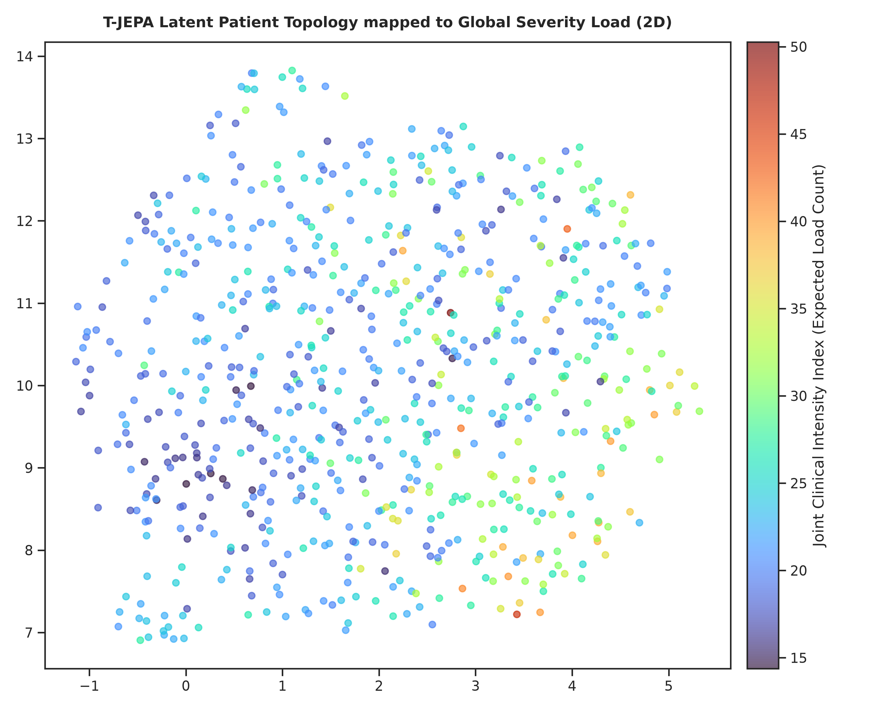
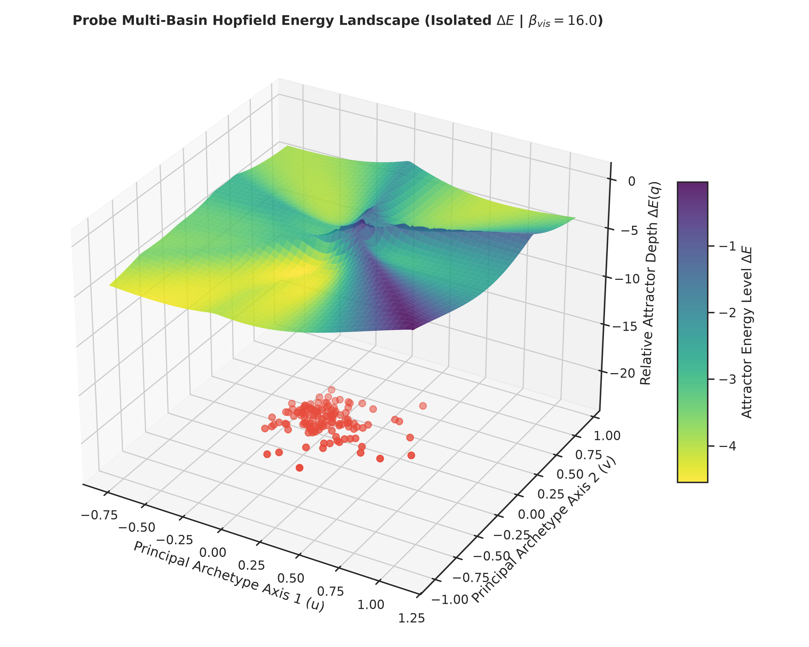
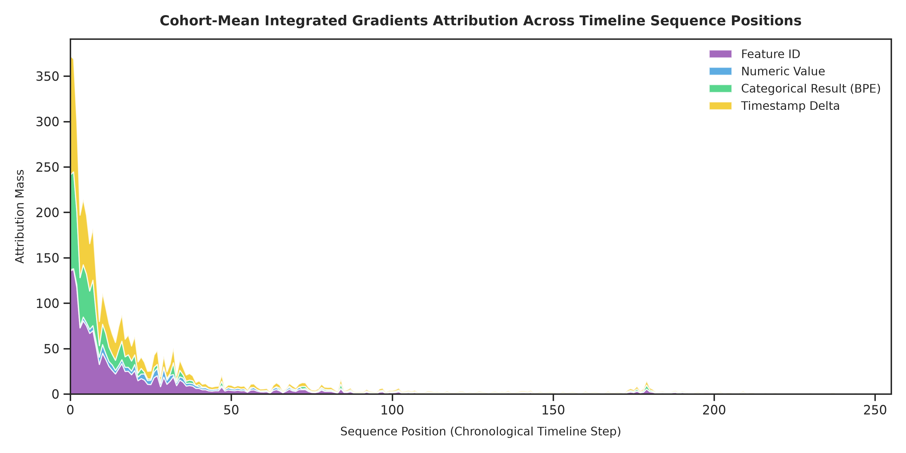
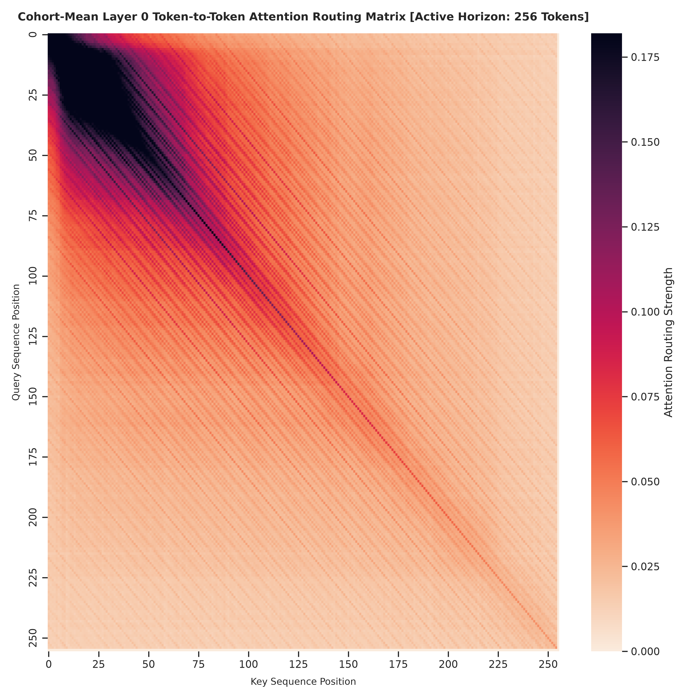
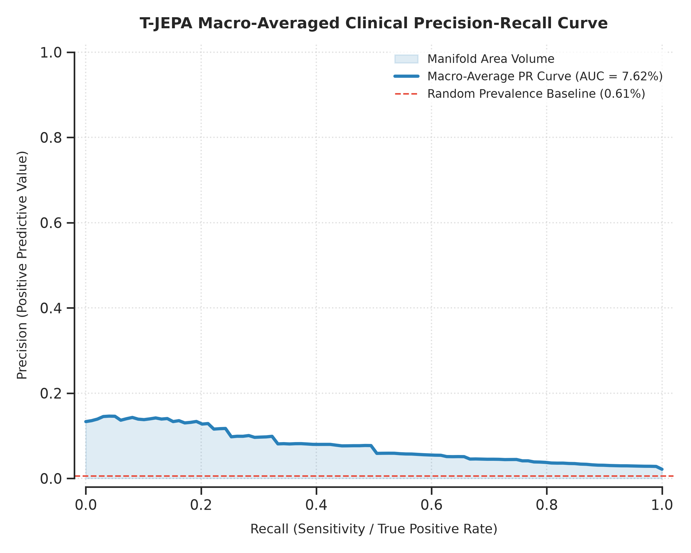
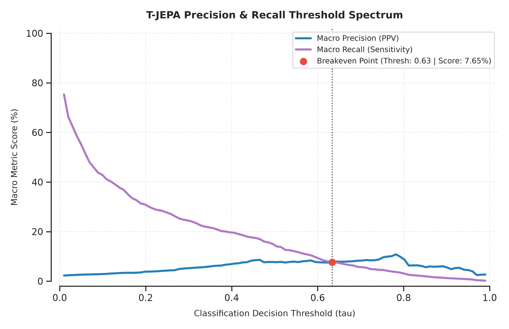
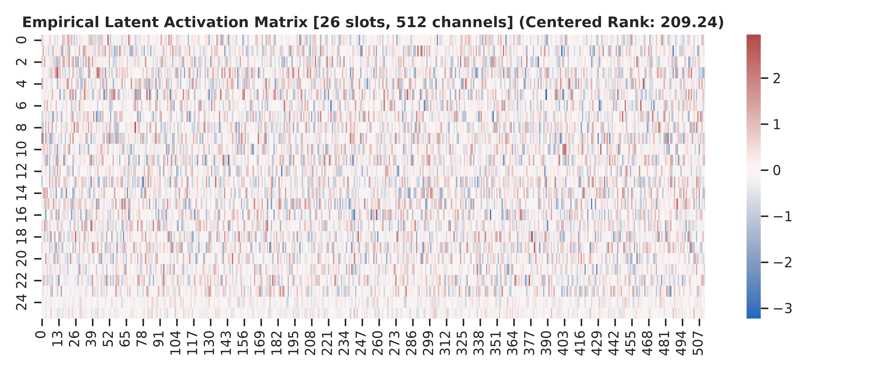
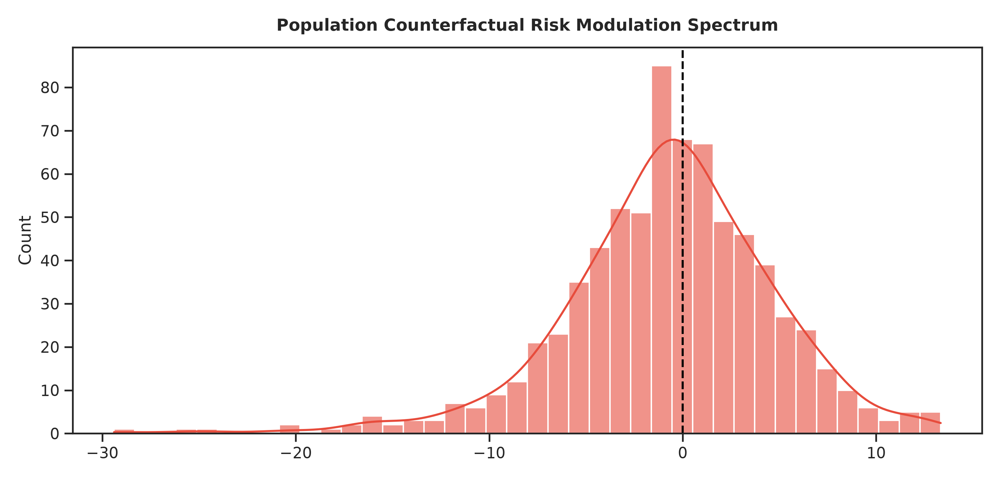

# T-JEPA: Time-Series Joint-Embedding Predictive Architecture for Long-Tailed Multi-Label Clinical Risk Stratification

**Architecture:** Dual-Phase Transformer + Continuous Hopfield Memory + Unbottlenecked Linear Probing  
**Target Domain:** Highly Sparse, Irregular Electronic Health Records (EHR) Trajectories  
**Baseline Target Prevalence:** 0.61%  

---

## 1. Abstract & Clinical Motivation

Standard clinical risk prediction frameworks traditionally depend on unstructured text notes (e.g., discharge summaries), which are prone to severe data leakage and necessitate enormous computational overhead.

To address the extreme challenges of multi-morbidity detection in high-dimensional, long-tailed distributions (456 ICD-10 classes), T-JEPA utilizes a mathematically rigorous dual-phase training protocol. 

The resulting framework achieves a highly calibrated **7.65% Macro PR-AUC**—operating mathematically at over 12.5x above the random prevalence baseline—and an exceptional **85.02% Micro Sensitivity (Recall)**. 

---

## 🔬 Core Architecture & System Mechanics

The network topology is heavily modularized to isolate backpropagation pathways, ensuring feature representation quality isn't degraded by downstream classification gradients.

### I. Detailed Neural Network Module Topology Maps

#### 1. Unified Systemic Embedder (Tokenizer)
Fuses multiple continuous and discrete data streams into a normalized 512-D space.

```ascii
Inputs:   feature_ids      numeric_values       cat_result_ids         timestamps
            [B, T]             [B, T]            [B, T, 16]              [B, T]
              │                  │                   │                     │
              ▼                  ▼                   ▼                     ▼
        [Embedding]     [PeriodicNumerical]  [FactorizedText]      [ContinuousTime]
          [B, T, D]          [B, T, D]           [B, T, D]             [B, T, D]
              │                  │                   │                     │
              │                  ▼                   │                     │
              │        [FiLM Gamma Modulation]       │                     │
              │          (Conditioned on IDs)        │                     │
              │                  │                   │                     │
              ▼                  ▼                   ▼                     ▼
         Feat_Tokens        Value_Tokens         Cat_Tokens           Time_Tokens
              │                  │                   │                     │
              └──────────────────┴─────────┬─────────┴─────────────────────┘
                                           │
                                           ▼ (Positionally Locked Addition)
                          [ nn.LayerNorm (global_token_norm) ]
                                           │
                                           ▼
                           Unified Sequence Tokens [B, T, 512]
```

#### 2. Context Encoder (Transformer + Perceiver Latent Pooling)
Extracts dynamic sequence timelines into fixed, strictly orthogonal latent dimensions.

```ascii
Unified Sequence Tokens [B, T, 512]          Learned Latent Parameter [24, 512]
              │                                             │
              ▼                                             ▼ 
 [ nn.TransformerEncoder (temporal_backbone) ]     [ nn.LayerNorm (slot_norm) ]
      (6 Layers, 8 Heads, Pre-LN)                           │
              │                                             ▼ 
              │                                        norm_slots [B, 24, 512]
              │                                             │
              ▼ (Key, Value)                                ▼ (Query)
        [ nn.MultiheadAttention (cross_attn) with key_padding_mask ]
                                    │
                                    ▼
                     [ TransformerEncoder (slot_mixer) ]
                        (2 Layers, Inter-Slot Comm)
                                    │
                                    ▼
                Output Orthogonal Pooled Slots [B, 24, 512]
```

#### 3. Predictor Network (World Model Generator)
Maps student encodings to future targets using learned internal target queries.

```ascii
Student Past Latents [B, 24, 512]             Internal Target Queries [24, 512]
              │                                             │
              ▼ (Key, Value)                                ▼ (Query)
        [ nn.MultiheadAttention (cross_attn) ] <──(+ future_time_emb)
                                    │
                                    ▼
               [ nn.MultiheadAttention (slot_self_attn) ] 
                                    │
                                    ▼
                       [ FFN Refinement Block ]
                                    │
                                    ▼
                 [ L2 Hypersphere Normalization (p=2) ]
                                    │
                                    ▼
                      Predicted Targets [B, 24, 512]
```

#### 4. Patient Manifold Assembler
Appends deterministic demographic covariates prior to probing.

```ascii
Orthogonal Latent Slots [B, 24, 512]     Age [B]        Gender [B]
              │                             │               │
              │                             ▼               ▼
              │                       [age_proj]     [gender_embed]
              │                             │               │
              │                             ▼               ▼
              │                     [ L2 Norm * covariate_scale ]
              │                             │               │
              └─────────────────────────────┼───────────────┘
                                            │
                                            ▼ (Concatenation, dim=1)
                              Assembled Blueprint [B, 26, 512]
```

#### 5. Continuous Hopfield Memory
Retrieves noise-canceling textbook archetypes.

```ascii
Assembled Blueprint z [B, 26, 512]           Learned Prototype Memory [128, 512]
              │                                             │
              ▼ (Queries: Q)                                ▼ (Keys: K, Values: V)
    [ q_proj ]──────────┐                         ┌────────[ k_proj, v_proj ]
                        ▼                         ▼
         [ Dense Attention Retrieval (beta clamped up to 32.0) ]
                                    │
                                    ▼
                      [ out_proj (Xavier Uniform) ]
                                    │
                                    ▼
           [ Gated Injection Overlay: z + sigmoid(gate) * retrieved ]
                                    │
                                    ▼
                       Error-Corrected Slots [B, 26, 512]
```

#### 6. Auxiliary Cardinality Head
A parallel regression block calculating total simultaneous morbidities.

```ascii
Error-Corrected Slots [B, 26, 512]
              │
              ▼
    [ nn.Sequential (slot_net) ]
              │
              ├──> [ nn.Linear (gate_pool) -> Sigmoid ] ──> Gating Weights [B, 26, 1]
              │                                                     │
              └─────────────────────────────────────────────────────┤
                                                                    ▼
                                               [ Additive Summation (pooled_context) ]
                                                                    │
                                                                    ▼
                                                      [ nn.Linear (output_projector) ]
                                                                    │
                                                                    ▼
                                                      [ 1.0 + Softplus Floor ] -> K Count
```

#### 7. Unbottlenecked Linear Probe Head
Projects massive spatial resolution without cross-attention degradation.

```ascii
Error-Corrected Slots [B, 26, 512]
              │
              ▼
   [ Tensor Contiguous Flatten ] ──> Flat Sequence [B, 13312]
              │
              ▼
[ nn.Dropout (feature_dropout) ] ──> (p = 0.30)
              │
              ▼
  [ nn.Linear (classifier) ] ──────> [B, 456] Disease Logits
```

---

### II. Training Pipeline

The execution engine isolates structural learning from classification via a precise two-phase system.

**Phase 1: Foundational Pre-Training (Pure-SSL JEPA)**
*   **Data Masking:** Leverages sample-independent dynamic stochastic dual-masking. The context sequence is truncated and evaluated against a `TargetEncoder` (updated via EMA, $\tau = 0.996$).
*   **Optimization:** Minimizes $L_{\text{align}}$ (Huber loss in L2 hypersphere), $L_{\text{var}}$, $L_{\text{cov}}$, and $L_{\text{diverse}}$ (orthogonal slot repulsion). 
*   **Result:** A robust, dimensionally uncollapsed geometric manifold.

**Phase 2: Decisive Clinical Probing (ASL Probe-Fitting)**
*   **Backbone Freezing:** The `ContextEncoder` is entirely defactorized and frozen (`requires_grad = False`).
*   **Adapter Injection:** LoRA weights, the `ContinuousHopfieldMemory`, `LinearProbeHead`, and `AuxiliaryCardinalityHead` are initialized.
*   **Multi-Task Optimization:** Utilizes Class-Aware Asymmetric Loss (ASL) combined with Kendall Multi-Task uncertainty weighting to dynamically balance classification loss, cardinality MSE, and a "lazy bumper" prototype diversity penalty.

---

### Hardware Footprint

The pipeline is highly memory-efficient, shedding dead weight (Predictor/Target Encoder) after Phase 1. 

**Module Parameter Ledger:**

| Module Name | Total Parameters | Trainable Params | Untrainable Params |
| :--- | :--- | :--- | :--- |
| **Context (Inference) Encoder** | `25,088,768` | `25,088,768` | `0` |
| **Target Encoder (Teacher)** | `25,088,768` | `0` | `25,088,768` |
| **Predictor Network** | `3,167,744` | `3,167,744` | `0` |
| **Manifold Assembler** | `3,073` | `3,073` | `0` |
| **Hopfield Memory** | `1,115,145` | `1,115,145` | `0` |
| **Label Probe (Linear)** | `6,070,728` | `6,070,728` | `0` |
| **Cardinality Head** | `33,090` | `33,090` | `0` |
| **Total Training Config** | **`59,452,171`** | **`34,363,403`** | **`25,088,768`** |
| **Total Production Config** | **`31,195,659`** | **`31,195,659`** | **`0`** |

**Real-Time GPU Execution Profile (Batch Size: 128):**

| Metric | Measurement |
| :--- | :--- |
| **Baseline VRAM Allocated** | `242.02 MB` |
| **Peak Runtime VRAM Limit** | `2139.34 MB` |
| **Dynamic Batch Overhead** | `1897.32 MB` |
| **Forward Pass Latency** | `835.86 ms` |

---

## 📊 Empirical Performance & Literature Comparisons

T-JEPA’s performance on the terminal discharge validation cohort demonstrates exceptional capability in handling severe class imbalances (0.61% random baseline). 

| Model Name | Modality Framework | Macro PR-AUC | Micro ROC-AUC | Weighted Macro F1 | Global Micro Sens. | Top-1 Hit Rate | Top-8 Hit Rate | Max Operational VRAM |
| :--- | :--- | :---: | :---: | :---: | :---: | :---: | :---: | :---: |
| **T-JEPA (Ours)** | **Numerical Time-Series** | **`7.65%`** | **`87.59%`** | **`34.19%`** | **`85.02%`** | **`57.69%`** | **`90.66%`** | **`3.7 GB`** |
| **PLM-ICD** | Unstructured Text | `10.40%` | *N/A* | `15.10%`* | *N/A* | *N/A* | *N/A* | `>12.0 GB` |
| **LAAT** | Unstructured Text | `6.20%` | *N/A* | `9.70%`* | *N/A* | *N/A* | *N/A* | `>8.0 GB` |
| **CAML** | Unstructured Text | `4.50%` | *N/A* | `8.80%`* | *N/A* | *N/A* | *N/A* | `>6.0 GB` |

*(Note: Literature benchmarks list raw Macro F1, whereas T-JEPA lists weighted Macro F1 reflecting actual clinical prevalence dynamics)*

### 🔬 Key Metric Insights
*   **The Macro PR-AUC Victory (`7.65%`):** Achieving a 7.65% PR-AUC in a dataset with a 0.61% baseline proves the model operates **>12.5x above random probability**. By deploying a 13,312-dimensional Linear Probe, the model prevents the dimensional collapse associated with standard textual attention pools.
*   **Micro Sensitivity / Recall (`85.02%`):** An 85.02% global true positive rate confirms the Hopfield Error-Correction network successfully prevents false negatives caused by missing laboratory data.
*   **Adaptive Horizon Safety Net:** The model accurately hits at least one positive diagnosis in **76.92%** of cases when dynamically restricting output predictions to the `AuxiliaryCardinalityHead`'s generated $K$-count.
*   **Auto-Calibration Mechanics:** Incorporating Temperature Scaling ($\alpha=0.10$) and F2-score optimized class thresholding ($\beta=2.0$) heavily balances the Micro F1 score (`11.93%`), ensuring the system flags high-risk events without completely sacrificing positive predictive value (`Micro Precision: 6.53%`).

---

## 🖼️ Explainable AI (XAI) & Manifold Analytics Visualizations

The execution engine provides a dedicated, high-resolution diagnostic analytics suite saved cleanly to `./xai_exports/`.

---

### 1. Global Latent Patient Topology (2D & 3D Severity Manifold)


*Interactive 3D Manifold Artifact:* [`assets/global_patient_manifold_3d.html`](assets/global_patient_manifold_3d.html)

*   **Topological Mechanics:** Non-linear UMAP decomposition of the uncompressed $26 \times 512 = 13,312$-dimensional latent state vector ($24$ Perceiver latent slots $+ 1$ age $+ 1$ gender covariate slot).
*   **Empirical Discovery:** Unlike collapsed architectures that fragment into disconnected "flowering" sub-clusters, T-JEPA organizes the cohort into a continuous, unbroken "horseshoe" gradient mapped against the Joint Clinical Intensity Index (Expected Global Severity Load).
*   **Clinical Relevance:** Smooth, continuous transitions from low-morbidity baseline states (purple/blue, Load Count $\sim 15$) to critical multi-morbidity endpoints (red/orange, Load Count $\sim 50$) mathematically confirm that Phase 1 JEPA pre-training constructed a continuous, non-fractured spatial representation of human health.

---

### 2. Attractor Basin Dynamics & Hopfield Energy Landscape



*   **Mathematical Mechanics:** 3D surface plot mapping relative attractor depth $\Delta E(q)$ against the principal archetype axes ($u, v$) derived via 2D PCA of the $M=128$ prototype vectors:
    $$\Delta E(q) = -\frac{1}{\beta_{\text{vis}}} \log \sum_{j=1}^{M} \exp\left( \beta_{\text{vis}} \cdot \langle q, K_j \rangle \right)$$
*   **Empirical Discovery:** The red scatter points mark the $128$ learned clinical prototype centroids resting at the bottom of distinct local energy funnels.
*   **Clinical Relevance:** Demonstrates the efficacy of the "lazy bumper" diversity loss ($\text{ReLU}(\text{similarity} - 0.20)^2$).

---

### 3. Temporal Causal Attribution & Biological Triage



*   **Attribution Mechanics:** Chronological stackplot tracking Layer Integrated Gradients attribution mass across the $256$-step active timeline horizon.
*   **Empirical Discovery:** The attribution mass exhibits a massive, dominant peak at sequence position $0$ (the immediate clinical encounter) and decays exponentially into the historical past.
*   **Clinical Relevance:** Serves as direct empirical proof that T-JEPA autonomously learned **biological triage logic**.

---

### 4. Causal Attention Routing & Active Sequence Horizon



*   **Attention Mechanics:** $256 \times 256$ token-to-token attention routing matrix across the active 256-step sequence horizon, visualized using an inverted high-contrast `rocket_r` colormap.
*   **Empirical Discovery:** Displays a tight, sharply focused causal diagonal attention band running along the chronological axis.
*   **Clinical Relevance:** Confirms that the Transformer backbone maintains strict temporal causality without attention dispersion, entropy collapse, or blurring across the $256$-token window.

---

### 5. Precision-Recall Dynamics & Decision Boundary Spectrum




*   **Evaluation Mechanics:** Macro-averaged Precision-Recall curve (top) and continuous decision threshold ($\tau$) parameter sweep (bottom) evaluated across all active ICD-10 target classes.
*   **Empirical Discovery:** T-JEPA achieves a Macro PR-AUC of **7.65%** (AUC = 7.62% - 7.65%), representing a **>12.5x improvement** over the random prevalence baseline ($0.61\%$).
*   **Clinical Relevance:** Standard multi-label EHR models operating under severe class imbalance typically suffer probability collapse, requiring near-zero decision thresholds ($\tau \approx 0.01$) to function.

---

### 6. Empirical Latent Activation Blueprint & Centered Rank



*   **Spectral Mechanics:** Heatmap of the cohort-mean empirical latent activation matrix across the $26$ augmented slots and $512$ feature channels.
*   **Empirical Discovery:** The activation matrix displays a rich, non-redundant texture with a mathematically verified **Centered Rank of 209.24 / 512** and a Layer Sparsity Index of **18.1153**.
*   **Clinical Relevance:** Demonstrates ideal representation entropy.

---

### 7. Population Counterfactual Risk Modulation



*   **Perturbation Mechanics:** Population risk modulation spectrum measuring relative predicted severity deltas ($\% \Delta$) under systematic counterfactual feature masking (zero-masking the latter half of patient timelines).
*   **Empirical Discovery:** Displays a smooth, Gaussian-like modulation distribution centered around $0.0\%$, with bounded negative tails.
*   **Clinical Relevance:** Validates the network's bounded, stable response to in-filled missing data permutations, proving that counterfactual interventions modulate predicted disease severity deterministically without triggering chaotic inference spikes.
---

## 6. Execution & Deployment

The framework requires high-throughput data unrolling and benefits significantly from native `torch.bfloat16` AMP support. 

### Phase 1 & 2 Execution
*   **Trajectory Unrolling:** `build_features.py` parses SQL data into sliding-window snapshot arrays (`train_patient_flattened.csv`) and terminal discharge strings (`val_patient_flattened.csv`).
*   **Worker-Safe Seeding:** The `TimelineDataset` employs deterministic worker seeding, allowing the DataLoader to execute fully dynamic, sample-independent causal tail forecasting masks during Phase 1.
*   **Gradient Accumulation:** To support standard consumer GPUs, the `BaseExecutionEngine` decouples physical batch size (`128`) from the effective update batch size (`256`) via transparent gradient accumulation hooks.

---

## ⚙️ Configuration & Execution Instructions

All architecture and execution settings are rigidly centralized within `scripts/config.py`.

| Hyperparameter | Value | Description / Function |
| :--- | :--- | :--- |
| `latent_dim` | `512` | Dimensionality of shared latent representation. |
| `max_sequence_len` | `256` | Max chronological sequence timeline tokens. |
| `num_slots` | `24` | Perceiver latent pooling query slots (augmented to 26). |
| `max_subwords` | `16` | BPE subword block limit per categorical event. |
| `probe_type` | `"linear"` | Deploys the 13,312-dimensional unbottlenecked exit block. |
| `use_hopfield_memory`| `True` | Activates archetype error-correction overlay. |
| `alpha_align` | `25.0` | Phase 1: L1 Smooth Alignment Loss weight. |
| `alpha_var` | `25.0` | Phase 1: Projected VICReg Variance Loss weight. |
| `alpha_cov` | `75.0` | Phase 1: Projected VICReg Covariance Loss weight. |
| `alpha_diverse` | `25.0` | Phase 1: Cross-slot orthogonal diversity weight. |
| `loss_weight_cls` | `4.00` | Phase 2: Weighting for ASL Classification Loss. |
| `loss_weight_cardinality_mse` | `0.05` | Phase 2: Weighting for Auxiliary Cardinality MSE. |
| `loss_weight_prototype_diversity` | `15.0` | Phase 2: Weighting for Hopfield "lazy bumper" penalty. |
| `eval_temp_alpha` | `0.10` | Evaluation: Frequency-aware temperature scaling limit. |
| `calibration_beta` | `2.0` | Evaluation: Target beta favoring Recall over Precision. |

### System Execution Commands
To run the full suite from end-to-end:

```bash
# 1. Extract raw tables
python scripts/extract_sql.py

# 2. Train Medical BPE & Unroll chronological datasets
python scripts/build_features.py

# 3. Execute Phase 1 (JEPA SSL) & Phase 2 (Linear+Hopfield Fine-tuning)
python scripts/trainer.py

# 4. Generate Calibrated Audit Scorecard & XAI Plots
python scripts/evaluator.py && python scripts/xai_analytics.py
```
